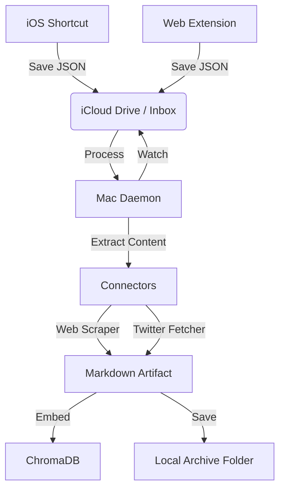

# OriginSteward: Technical Design Doc

> **Focus:** Robust Ingestion Pipeline & Chroma Integration

---

## 1. System Architecture

The system follows a **Producer-Consumer** pattern using the filesystem as the queue. This decouples the "Capture" (Mobile/Web) from the "Processing" (Mac).

### 1.1 Diagram



---

## 2. Component Design

### 2.1 The Ingestion Daemon (`ingest_daemon.py`)
*   **Library:** `watchdog` (Python).
*   **Responsibility:** Monitors `~/Documents/OriginSteward/Inbox`.
*   **Logic:**
    1.  Event: `FileCreated`.
    2.  Wait 1s (debounce/ensure write complete).
    3.  Read file content.
    4.  Determine type (`url`, `tweet`, `text`) based on file extension or JSON content.
    5.  Dispatch to Connector.
    6.  On Success: Move to `Archive/YYYY-MM-DD/`.
    7.  On Failure: Move to `Error/` with `error.log`.

### 2.2 Connectors

#### 2.2.1 Web Connector
*   **Libraries:** `requests`, `beautifulsoup4`, `readability-lxml`.
*   **Logic:**
    *   `GET` url.
    *   Pass HTML to `Document(html).summary()` (Readability).
    *   Convert HTML summary to Markdown (`markdownify`).
    *   Extract Metadata: Title, Domain, Date.
*   **Error Handling:**
    *   If `requests` fails (404/500): Log error, move JSON to `Error/` folder.
    *   If parsing fails: Save raw HTML to `Archive/` with `_raw.html` extension.

#### 2.2.2 Twitter Connector
*   **Library:** `yt-dlp` (via subprocess).
*   **Logic:**
    *   Command: `yt-dlp --dump-json --skip-download [URL]`
    *   Extract: `description` (text), `uploader_id` (handle), `upload_date`.
*   **Error Handling:**
    *   If `yt-dlp` fails (e.g., "Video unavailable" or Rate Limit):
        *   Log specific error code.
        *   **Fallback:** Create a Markdown file with just the URL and tag `#to_read`.
        *   Move original JSON to `Archive/` (don't discard).

### 2.3 The Brain (ChromaDB)
*   **Library:** `chromadb`.
*   **Configuration:** `PersistentClient(path="./chroma_db")`.
*   **Embedding Model:** `sentence-transformers/all-MiniLM-L6-v2` (Fast, local, good enough).
*   **Collection Schema:**
    *   `ids`: Filename (unique).
    *   `documents`: The full Markdown content.
    *   `metadatas`: `{"source": "twitter", "author": "...", "date": "..."}`.

---

## 3. Data Formats

### 3.1 Input Format (The "Drop")
The iOS Shortcut MUST generate a JSON file with this exact schema:

```json
{
  "$schema": "http://json-schema.org/draft-07/schema#",
  "type": "object",
  "properties": {
    "type": { "enum": ["url", "tweet", "text"] },
    "payload": { "type": "string" },
    "timestamp": { "type": "number" },
    "note": { "type": "string" }
  },
  "required": ["type", "payload", "timestamp"]
}
```

**Example Payload:**
```json
{
  "type": "url",
  "payload": "https://twitter.com/user/status/123456",
  "timestamp": 1702480000,
  "note": "Check this thread out later"
}
```

### 3.2 Storage Format (The Artifact)
Saved as `Archive/2025-12-13/tweet_123456.md`:

```markdown
---
id: tweet_123456
source: https://twitter.com/user/status/123456
author: @user
date: 2025-12-13
tags: [twitter, ai]
---

# Tweet by @user

Here is the full text of the tweet...

> User comment: This is why I saved this.
```

---

## 4. Implementation Plan (Phase 1)

1.  **Setup Env:** `pip install chromadb watchdog beautifulsoup4 markdownify`.
2.  **Create Dir Structure:** `Inbox`, `Archive`, `Error`.
3.  **Write Daemon:** Basic loop to print "New file found".
4.  **Write Web Connector:** Test with a sample URL.
5.  **Integrate Chroma:** Index the output of the Web Connector.
